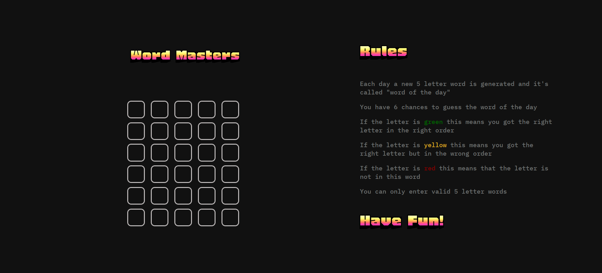

# Word Masters

Welcome to Word Masters! This is a word-guessing game built with HTML, CSS, and JavaScript.

## Overview

Word Masters is a simple yet challenging word-guessing game where the player has to guess the word of the day. Each day, a new 5-letter random word is generated as the word of the day. The player has 6 chances to guess the word correctly.

## How to Play

1. Open the game in your web browser.
2. You will see a row of input boxes for each letter of the word.
3. Enter a 5-letter word into the input boxes and submit your guess.
4. After submitting your guess, the game will provide feedback:
   - Green letters indicate that the letter is in the correct position in the word.
   - Yellow letters indicate that the letter is in the word but in the wrong position.
   - Red letters indicate that the letter is not in the word.
5. Based on the feedback, refine your guess and submit again.
6. Repeat steps 3-5 until you correctly guess the word or run out of chances.

## Rules

- The word of the day is always a 5-letter random word.
- The player has 6 chances to guess the word correctly.
- Each guess must be a valid 5-letter word.
- Feedback will be provided after each guess to help the player refine their guesses.

## Technologies Used

- HTML: Used for structuring the web page.
- CSS: Used for styling and layout.
- JavaScript: Used for game logic and user interaction.

  
## Demo

You can play Word Masters here: https://word-masters-tau.vercel.app/

## Screenshots

## Compatibility
Please note that Word Masters is optimized for web browsers on PCs or laptops and may not be compatible with mobile phones.

## Credits
This project was created by Muhammad Salah. Feel free to contribute or provide feedback!
